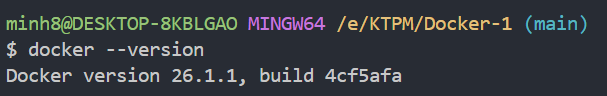
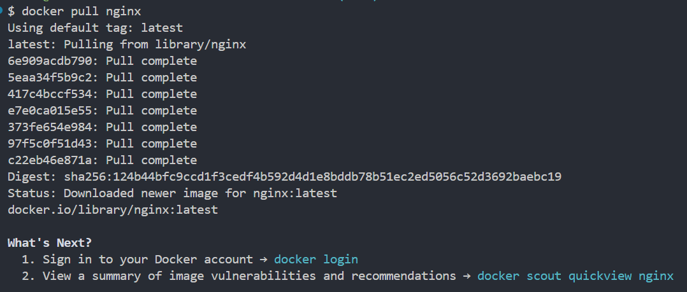

# Tài Liệu Tham Khảo Lệnh Docker

Tài liệu này cung cấp tham khảo cho các lệnh Docker phổ biến kèm theo giải thích.

## Kiểm Tra Cài Đặt Docker

```bash
docker --version
```

Hiển thị phiên bản Docker đã cài đặt.



## Các Lệnh Docker Cơ Bản

### Chạy Hello World

```bash
docker run hello-world
```

Xác minh cài đặt Docker bằng cách chạy một container thử nghiệm.


### Tải Một Image

```bash
docker pull nginx
```

Tải image nginx từ Docker Hub.



### Liệt Kê Các Image

```bash
docker images
```

Hiển thị tất cả các Docker image được lưu trữ cục bộ.


## Quản Lý Container

### Chạy Container ở Chế Độ Nền

```bash
docker run -d nginx
```

Khởi động container nginx trong nền.


### Liệt Kê Các Container Đang Chạy

```bash
docker ps
```

Hiển thị tất cả các container đang chạy.


### Liệt Kê Tất Cả Các Container

```bash
docker ps -a
```

Hiển thị tất cả các container (đang chạy và đã dừng).


### Xem Nhật Ký Container

```bash
docker logs 8f9885a3d376
```

Hiển thị nhật ký từ một container cụ thể.


### Thực Thi Lệnh Trong Container

```bash
docker exec -it <container_id> /bin/sh
```

Mở một shell tương tác trong container đang chạy.


### Dừng Container

```bash
docker stop <container_id>
```

Dừng một container đang chạy.


### Khởi Động Lại Container

```bash
docker restart <container_id>
```

Khởi động lại một container.


### Xóa Container

```bash
docker rm <container_id>
```

Xóa một container đã dừng.


### Xóa Tất Cả Các Container Đã Dừng

```bash
docker container prune
```

Xóa tất cả các container đã dừng.


## Quản Lý Image

### Xóa Một Image

```bash
docker rmi <image_id>
```

Xóa một Docker image.


### Xóa Tất Cả Các Image Không Sử Dụng

```bash
docker image prune -a
```

Xóa tất cả các image không được sử dụng.


## Ánh Xạ Cổng

### Chạy Container Với Ánh Xạ Cổng

```bash
docker run -d -p 8080:80 nginx
```

Chạy nginx với cổng 8080 trên máy chủ được ánh xạ đến cổng 80 trong container.


## Kiểm Tra Container

### Kiểm Tra Chi Tiết Container

```bash
docker inspect <container_id>
```

Hiển thị thông tin chi tiết về một container.


## Quản Lý Volume

### Chạy Container Với Volume

```bash
docker run -d -v mydata:/data nginx
```

Chạy nginx với một volume có tên "mydata" được gắn tại /data.


### Liệt Kê Các Volume

```bash
docker volume ls
```

Hiển thị tất cả các Docker volume.


### Xóa Các Volume Không Sử Dụng

```bash
docker volume prune
```

Xóa tất cả các volume không được sử dụng.


## Đặt Tên Container

### Chạy Container Với Tên Tùy Chỉnh

```bash
docker run -d --name my_nginx nginx
```

Chạy một container nginx với một tên tùy chỉnh.


## Giám Sát Container

### Hiển Thị Sử Dụng Tài Nguyên Container

```bash
docker stats
```

Hiển thị luồng trực tiếp về thống kê sử dụng tài nguyên của container.


## Quản Lý Mạng

### Liệt Kê Các Mạng

```bash
docker network ls
```

Hiển thị tất cả các mạng Docker.


### Tạo Một Mạng

```bash
docker network create my_network
```

Tạo một mạng Docker mới có tên "my_network".


### Chạy Container Trên Một Mạng

```bash
docker run -d --network my_network --name my_container nginx
```

Chạy một container được kết nối với một mạng cụ thể.


### Kết Nối Container Vào Mạng

```bash
docker network connect my_network my_nginx
```

Kết nối một container hiện có với một mạng.


## Biến Môi Trường

### Chạy Container Với Biến Môi Trường

```bash
docker run -d -e MY_ENV=hello_world nginx
```

Chạy nginx với một biến môi trường.


## Nhật Ký Nâng Cao

### Theo Dõi Nhật Ký Container

```bash
docker logs -f my_nginx
```

Liên tục hiển thị nhật ký mới từ một container.


## Xây Dựng Image Tùy Chỉnh

Để xây dựng một image tùy chỉnh, tạo một Dockerfile:

```dockerfile
FROM nginx
COPY index.html /usr/share/nginx/html/index.html
```

Sau đó xây dựng và chạy image:

```bash
docker build -t my_nginx_image .
docker run -d -p 8080:80 my_nginx_image
```

Điều này xây dựng một image tùy chỉnh dựa trên nginx và chạy nó với ánh xạ cổng.


